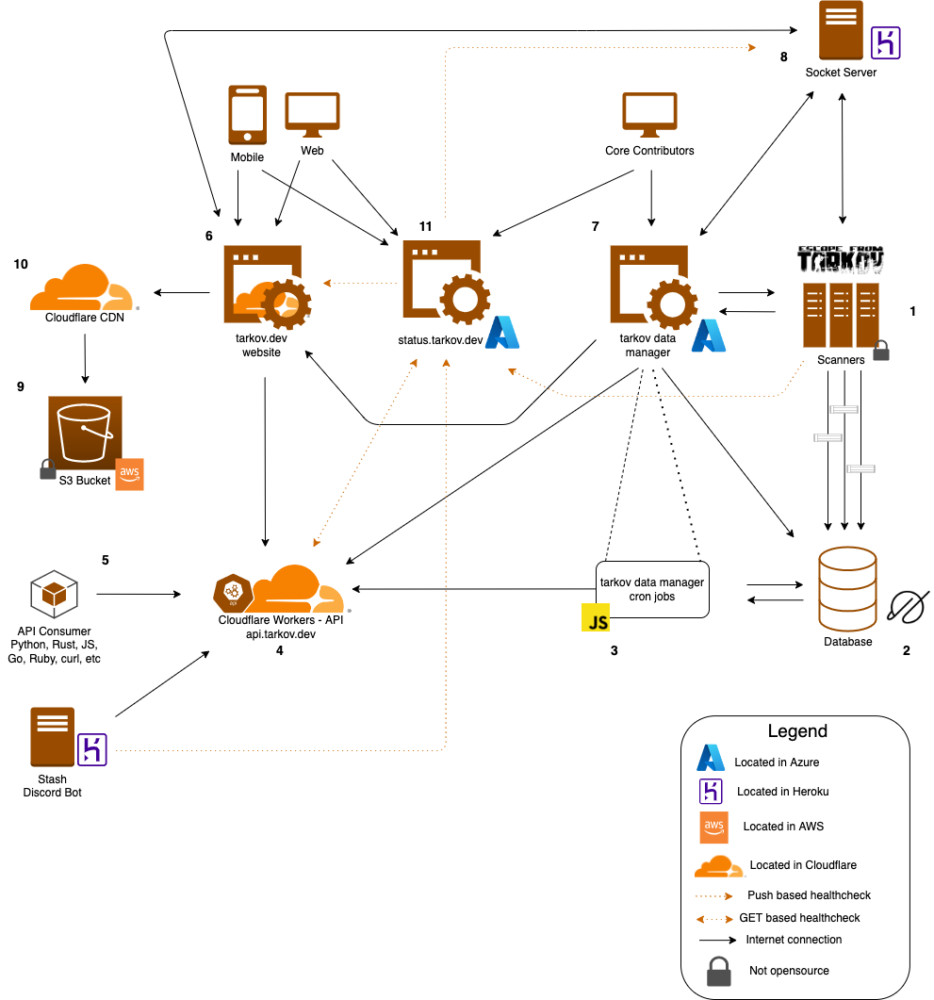

# Infrastructure 🧱

The goal for all infrastructure in this project is to be as simple as possible while being robust, distributed, and scalable. We also aim to have all components open-soruce, maintainable, and easy for contributors to contribute to.

## Architecture Diagram 🏗️

To help maintainers and future contributors wrap their heads around the infrastructure we have deployed, we have created an architecture diagram which lays everything out.

> Below is a description of the numbered labels in the diagram

1. **Scanners** - The scanners are responsible for scanning data from the Escape from Tarkov game. This is the only portion of the project that is closed source. The scanners collect data and publish it to the main sql database for storage
1. **The Database** - The database is where all flea market and other data is stored. The database is hosted in [planetscale](https://planetscale.com/)
1. **GitHub Actions** - All cron jobs to sync the database with the API (cloudflare workers) are run through [GitHub Actions](https://github.com/features/actions) - [tarkov-crons](https://github.com/the-hideout/tarkov-crons)
1. **API** - The API which powers everything for [tarkov.dev](https://tarkov.dev) is run using [cloudflare workers](https://workers.cloudflare.com/) - [tarkov-data-api](https://github.com/the-hideout/tarkov-data-api)
1. **API Consumers** - API consumers are anything and anyone that is using the GraphQL API. This could be you or one of the many projects using our API 😄. You can try out the API with the following playground - [api.tarkov.dev/___graphql](https://api.tarkov.dev/___graphql)
1. **tarkov.dev** - The main website ([tarkov.dev](https://tarkov.dev)) is powered by [Cloudflare Pages](https://pages.cloudflare.com/) and uses the graphql API to render data for item prices, weapon stats, and more! - [tarkov.dev site repo](https://github.com/the-hideout/tarkov-tools)
1. **Tarkov Data Manager** - The `tarkov-data-manager` is a tool used by primary contributors to this project. It manages data in the database, helps control the game scanners, and interacts with the cloudflare workers as well. It is hosted in an Azure VM - [tarkov-data-manager](https://github.com/the-hideout/tarkov-data-manager)
1. **Socket Server** - The socket server is used with [tarkov.dev](https://tarkov.dev) to control the site with another device (mobile control feature). It is also used to collect console output from scanners with the the `tarkov-data-manager`. It is hosted in Heroku - [tarkov-socket-server](https://github.com/the-hideout/tarkov-socket-server)
1. **Static S3 Bucket** - Static assets (mainly images) for [tarkov.dev](https://tarkov.dev) are stored in an S3 bucket. This bucket is used with Cloudflare's CDN
1. **Cloudflare CDN** - The [Cloudflare CDN](https://www.cloudflare.com/cdn/) is used to serve static assets (mainly images) to [tarkov.dev](https://tarkov.dev) site and the [tarkov-data-manager](https://github.com/the-hideout/tarkov-data-manager). It reads these images from an S3 bucket and caches them on Cloudflare's edge to serve them quickly to clients in a distributed manner
